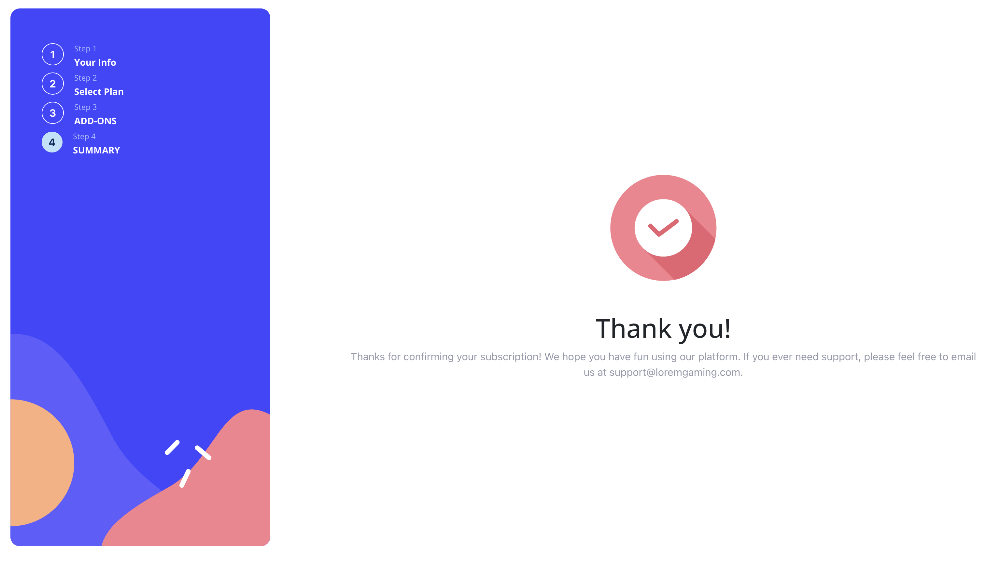

# Multi-step app form

A form that allows users to complete each step of the sequence, go back to a previous step to update their selections and see a summary of their selections on the final step and confirm their order.

# About the website

The multi-step form project includes the following pages:

- Personal Info
- Select Plan
- Add-On
- Summary

# Features

The Multi-step app form project includes the following features:

- First page that includes personal info for user
- Second page that includes plans that user can select
- Third page that includes Add-Ons that user can choose
- Forth page that includes summary of what user done 
- Finally Thank you modal

# Technologies Used
- React
- Bootstrap
- CSS

# Screenshots

# Project Link 
https://youssef-eissa.github.io/multi-step-app-form
